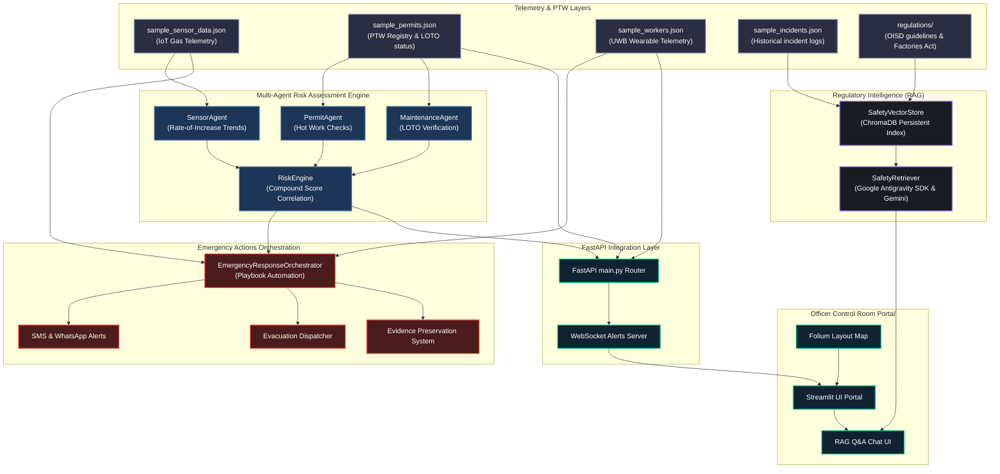

# System Architecture Diagram

This document details the software architecture, data flow, and agent integration layers for the **Industrial Safety Guardian** platform.

## Data Flow Narrative
1. **Anomaly & Telemetry Assessment**:
   - The `SensorAgent` tracks gas readouts in real-time, focusing on percentage-based rate of increase (>2% per minute triggers anomaly flags).
   - The `PermitAgent` monitors work permits and identifies zones with active "Hot Work" permits.
   - The `MaintenanceAgent` checks lock-out tag-out (LOTO) verification fields.

2. **Risk Correlation & Prediction**:
   - The `RiskEngine` pulls inputs from the sub-agents and correlates them into a compound safety risk index score between `0.0` and `1.0`.
   - The score escalates early—alerting safety officers **45 minutes before** gas levels reach high threat thresholds, by identifying combinations of active welding and rising gas trends.

3. **Autonomous Emergency Response**:
   - If risk score exceeds `0.80`, `EmergencyResponseOrchestrator` triggers evacuation logs, drafts compliance documents based on regulation references, and preserves sensor spool evidence to JSON logs.

4. **Regulatory RAG System**:
   - Safety officers query the `SafetyRetriever` on guidelines or previous near-miss reports, which performs vector database similarity searches using ChromaDB and generates responses via the Gemini model (Google Antigravity SDK).
